<p align="center">
  
</p>

<h1 align="center">Highlight</h1>
<p align="center">AI-Powered SEO & AI Visibility SaaS Platform</p>

<p align="center">
  Bridging traditional SEO with <b>Generative Engine Optimisation (GEO)</b> — get found by Google <i>and</i> by ChatGPT, Perplexity, and Google AI Overviews.
</p>

<p align="center">
  <a href="./NOTICE.md"></a>
  
  
  
  
  
</p>

<p align="center">
  <a href="https://highlight-teal.vercel.app"><b>🔗 Live Demo</b></a> ·
  <a href="#screenshots">Screenshots</a> ·
  <a href="#installation">Installation</a> ·
  <a href="#future-roadmap">Roadmap</a>
</p>

---

## Table of Contents

- [Overview](#overview)
- [Key Features](#key-features)
- [Screenshots](#screenshots)
- [Tech Stack](#tech-stack)
- [Architecture Overview](#architecture-overview)
- [Installation](#installation)
- [Live Demo](#live-demo)
- [Future Roadmap](#future-roadmap)
- [Contributing](#contributing)
- [License](#license)
- [Author](#author)

---

## Overview

**Highlight** is a full-stack SaaS platform that automates website SEO audits and AI-assisted content generation, and — its core differentiator — scores **AI visibility**: how often a brand is *cited* inside AI-generated answers (ChatGPT, Perplexity, Google AI Overviews), not just how it ranks in classic Google search.

## Key Features

| | |
|---|---|
| 🔍 **SEO Audit & Fixes** | Crawls a whole site, scores site health, detects issues (missing H1s, thin content, missing alt text), and generates AI fix suggestions |
| ✍️ **Prompt Optimisation** | Turns a seed keyword into GEO-ready prompt variations with OpenAI |
| 📝 **AI Content Generation** | Generates blog posts, FAQs, and meta content grounded in a site's own indexed content via RAG |
| 👁️ **AI Visibility / GEO** | Live Share-of-Voice scans across Perplexity, ChatGPT, Google AI Overview, and Gemini — detects real citations |
| 📊 **Competitor Benchmarking** | Real Google SERP rankings plus keyword-density and semantic-gap comparison |
| 🔗 **Backlinks & Outreach** | Finds link-building prospects and drafts personalised outreach emails |
| 🧠 **LSI Keywords** | Extracts semantic keyword gaps from a site's indexed content |
| ♻️ **Content Refresh** | Scheduled workflow that periodically re-audits and flags stale content |
| 🚀 **Run Full Analysis** | One-click orchestrator that chains audit → prompts → visibility scan → an AI-generated action plan into a single Highlight Score |
| 📈 **Analytics** | Content metrics plus optional live Google Analytics 4 traffic charts |
| 💳 **Plans & Billing** | Free / Pro / Agency tiers with quota and feature gating |
| 🔐 **Auth & RBAC** | JWT auth, email verification, password reset, and role-based access control |

## Screenshots

<table>
<tr>
<td width="50%">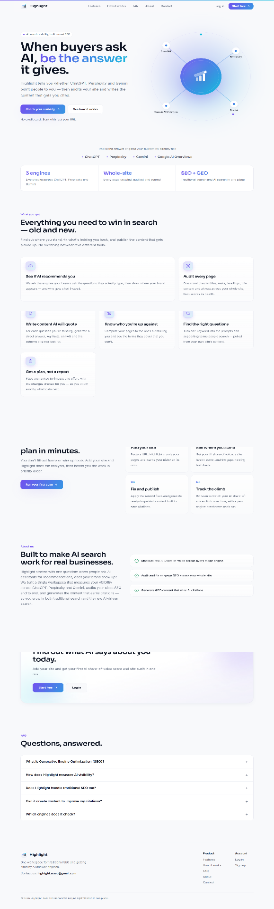<p align="center"><sub>Landing page</sub></p></td>
<td width="50%">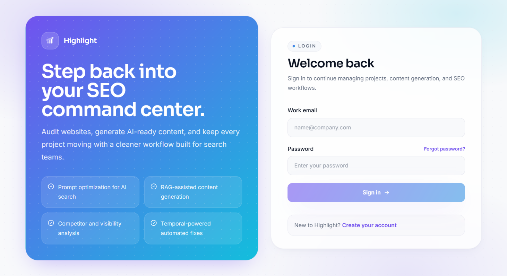<p align="center"><sub>Login</sub></p></td>
</tr>
<tr>
<td width="50%">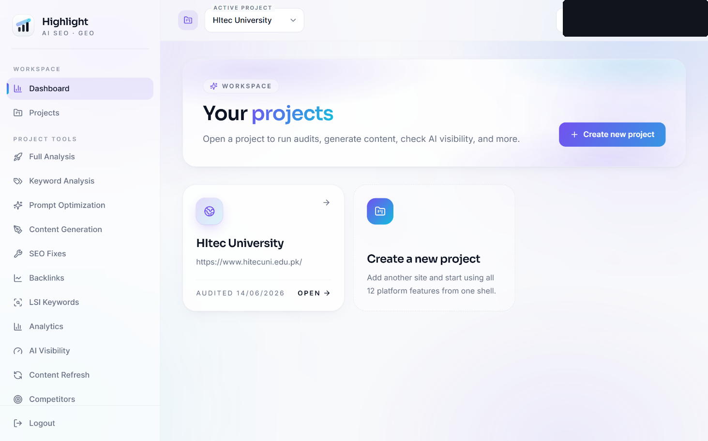<p align="center"><sub>Dashboard</sub></p></td>
<td width="50%">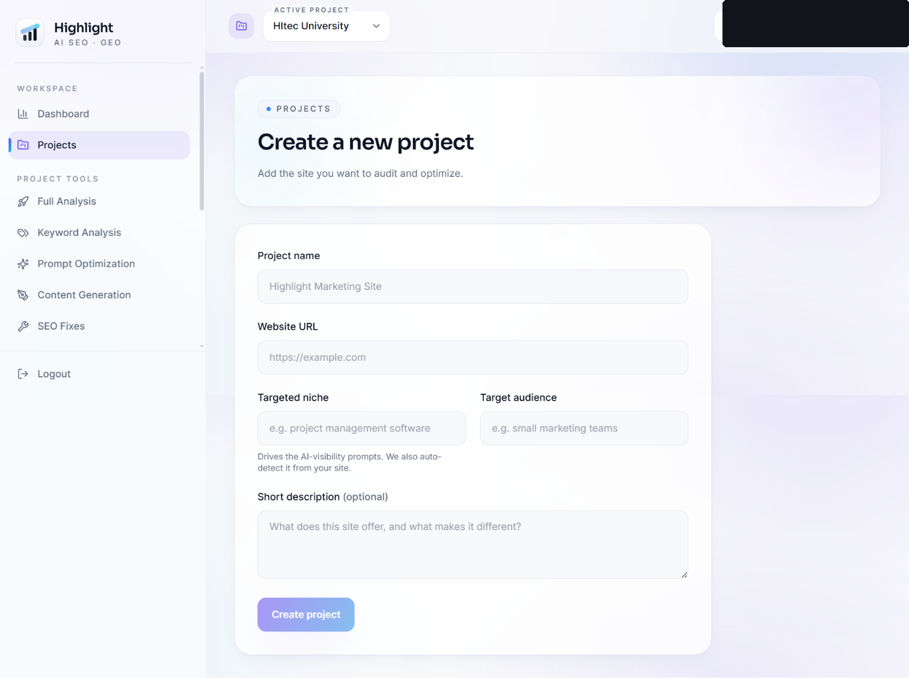<p align="center"><sub>Create project</sub></p></td>
</tr>
<tr>
<td width="50%">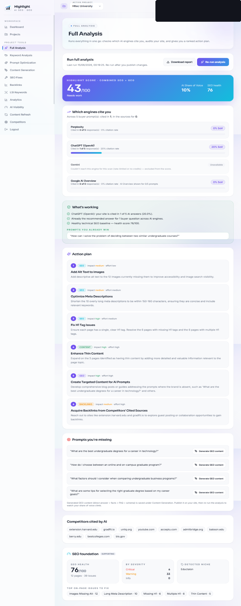<p align="center"><sub>SEO audit</sub></p></td>
<td width="50%">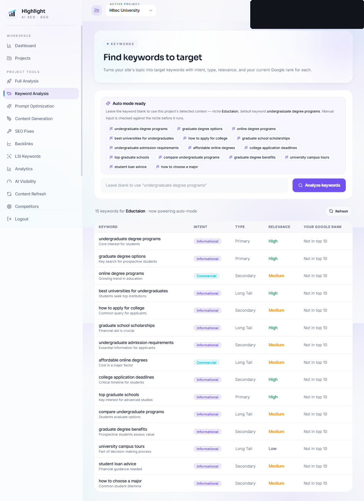<p align="center"><sub>Keyword analysis</sub></p></td>
</tr>
<tr>
<td width="50%">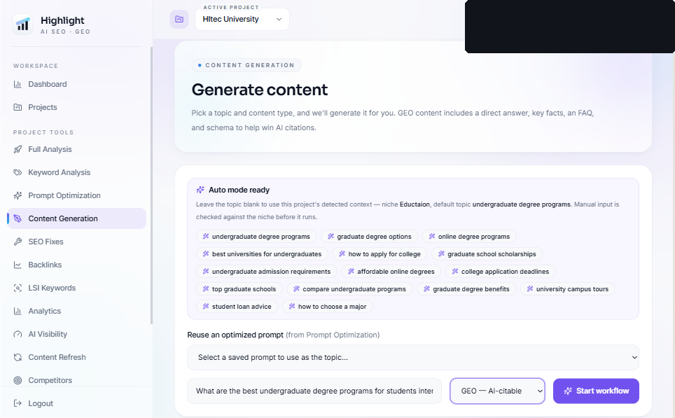<p align="center"><sub>AI content generation</sub></p></td>
<td width="50%">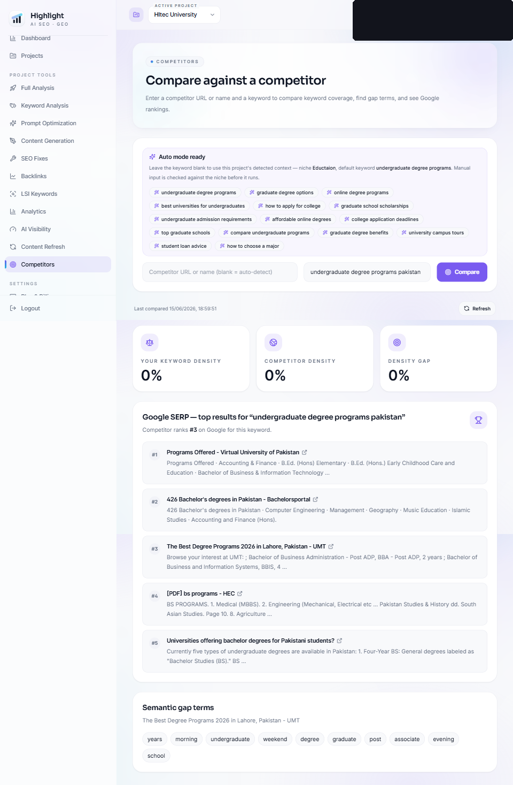<p align="center"><sub>Competitor benchmarking</sub></p></td>
</tr>
<tr>
<td width="50%">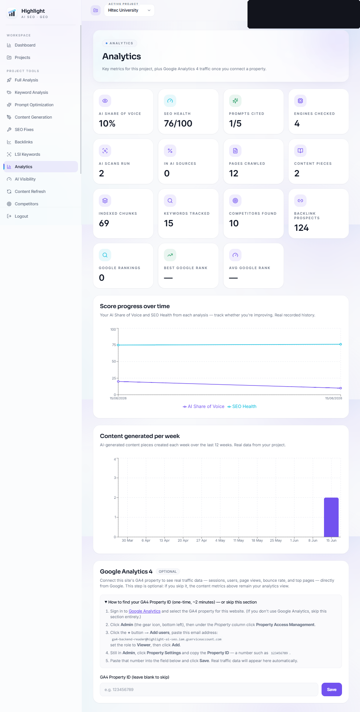<p align="center"><sub>Analytics</sub></p></td>
<td width="50%">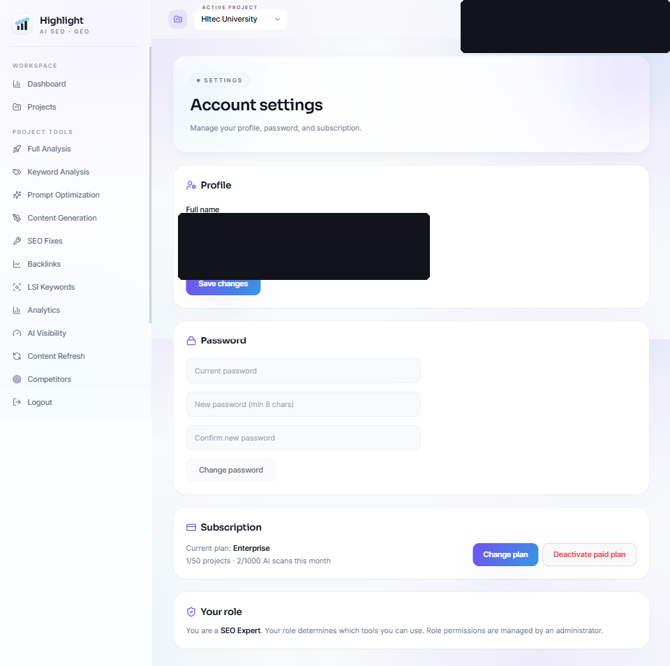<p align="center"><sub>Account settings</sub></p></td>
</tr>
</table>

More screens — registration, backlinks, outreach email generation, content refresh, SEO reports — are in [`docs/screenshots/`](docs/screenshots/).

## Tech Stack

| Layer | Technology |
|---|---|
| Frontend | Next.js 15 (App Router), React 19, TypeScript, Tailwind CSS, Zustand, Recharts |
| Backend | FastAPI (Python), SQLModel ORM |
| Database | PostgreSQL + `pgvector` (RAG embeddings) |
| Workflows | Temporal (background jobs, cron scheduling) |
| AI / LLM | OpenAI GPT-4o |
| GEO data sources | Perplexity, Google SERP, Gemini |
| Payments | Stripe |
| Cache / Queue | Redis |
| Containerisation | Docker + Docker Compose |
| Testing / CI | pytest · Cypress · GitHub Actions |
| Hosting (live) | Frontend on Vercel · Backend + Postgres + Temporal on AWS EC2 |

## Architecture Overview

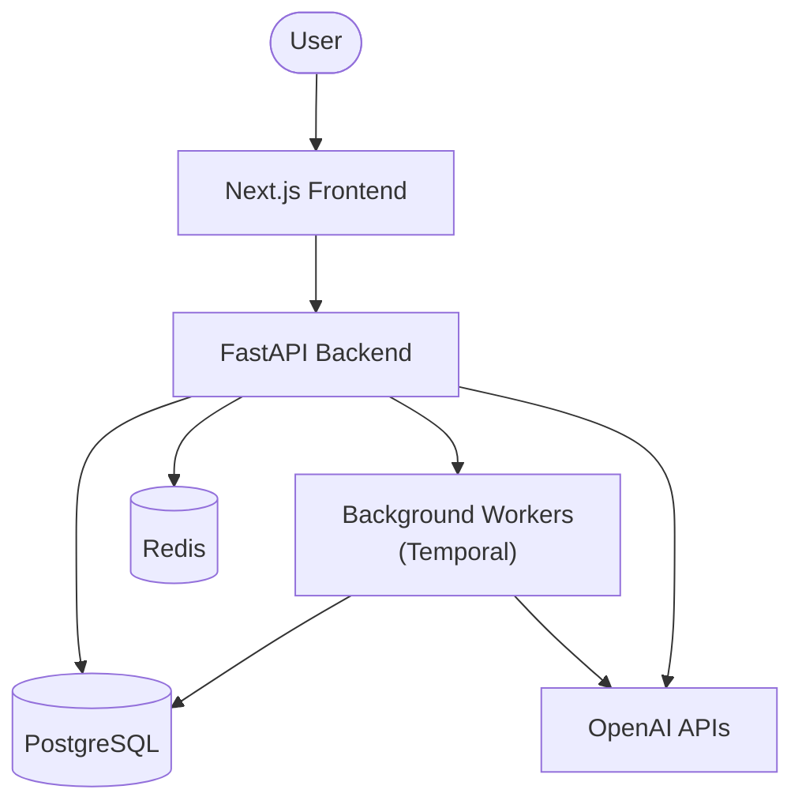

The browser only ever talks to the Next.js frontend, which proxies API requests to the FastAPI backend. The backend reads/writes PostgreSQL directly, uses Redis for caching, and hands off long-running or scheduled work (audits, content generation, refresh cycles) to Temporal background workers — which also call OpenAI and write their results back to PostgreSQL. In production, the frontend is deployed on Vercel and the backend/database/workers run together on a single AWS EC2 host via Docker Compose.

**Database schema** is managed by SQLModel's `create_all()` plus a small set of idempotent `ALTER TABLE ... IF NOT EXISTS` statements in the startup lifespan (`backend/app/main.py`), rather than a migration tool. This keeps deployment to a single `git pull` + restart with no migration step, at the cost of no down-migrations or version history — a deliberate trade-off for a project of this size. Alembic would be the natural next step if the schema churned across multiple environments.

**Outbound fetches are SSRF-guarded**: the crawler and scraper accept user-supplied URLs, so every fetch resolves the hostname and rejects loopback, link-local (including cloud metadata endpoints), and private ranges, re-validating on each redirect hop (`backend/app/core/url_guard.py`).

## Installation

### Prerequisites

| Tool | Min version |
|---|---|
| Docker Desktop | 24+ |
| Node.js | 20+ |
| Python | 3.11+ |
| Git | any |

### 1. Configure environment variables

Copy [`.env.example`](.env.example) to `.env` and fill in your own values (at minimum `OPENAI_API_KEY`):

```bash
cp .env.example .env        # Mac/Linux
copy .env.example .env      # Windows
```

Every key except `OPENAI_API_KEY` is optional — the app has graceful fallbacks for each. See `.env.example` for the full reference and where to get each key.

### 2. Start the stack via Docker

```bash
docker compose up --build
```

This starts the database, Redis, Temporal, the FastAPI backend, the Temporal worker, and the Next.js frontend. Open **http://localhost:3000**, sign up with any email, and create a project.

```bash
docker compose down           # stop, keep data
docker compose down -v        # stop and wipe all data
```

Two additional Compose files support production deployment: `docker-compose.prod.yml` (all-in-one, single server with a reverse proxy) and `docker-compose.ec2.yml` (backend-only, for a split frontend/backend deployment).

### 3. Run frontend and backend individually (optional, for local development)

```bash
# Database + infra
docker compose up db redis temporal temporal-ui -d

# Backend (in backend/, with a virtualenv)
pip install -r requirements.txt
uvicorn app.main:app --reload --host 127.0.0.1 --port 8000

# Temporal worker (second terminal, in backend/)
python -m app.temporal.worker

# Frontend (in frontend/)
npm install
npm run dev
```

## Live Demo

**🔗 https://highlight-teal.vercel.app**

Sign up with any email to explore — AI features run against live APIs, so results are real, not seeded or mocked data.

> The backend may be paused between demos to control hosting cost — if it appears unreachable, it may need to be restarted.

## Future Roadmap

- [x] Automated backend test suite (pytest)
- [x] CI pipeline (lint, build, test on every pull request)
- [ ] Expand test coverage to the crawler and GEO scanning services
- [ ] Self-serve Google Analytics 4 connection (currently requires manual setup)
- [ ] Production-ready Stripe billing (currently test-mode)
- [ ] Custom domain + HTTPS for the backend API
- [ ] Additional AI answer engines as GEO coverage expands
- [ ] Multi-locale / multi-language SEO support

## Contributing

This is a personal portfolio project and isn't currently open to external contributions. If you spot a bug, feel free to open an issue.

## License

This repository is source-available for portfolio and recruitment evaluation purposes only — it is **not** open source. All rights are reserved; no permission is granted to copy, modify, distribute, or reuse this code without prior written permission. See [`NOTICE.md`](NOTICE.md) for the full notice.

## Author

**Mohammad Sarib Ali**
[GitHub @rao-sarib](https://github.com/rao-sarib)

Originally developed together with Eman Ali and Hamna Imran.
